<!-- markdownlint-capture -->
<!-- markdownlint-disable -->

# Code Metrics

This file is dynamically maintained by a bot, *please do not* edit this by hand. It represents various [code metrics](https://aka.ms/dotnet/code-metrics), such as cyclomatic complexity, maintainability index, and so on.

<div id='demo'></div>

## Demo :heavy_check_mark:

The *Demo.csproj* project file contains:

- 4 namespaces.
- 9 named types.
- 257 total lines of source code.
- Approximately 102 lines of executable code.
- The highest cyclomatic complexity is 5 :heavy_check_mark:.

<details>
<summary>
  <strong id="global+namespace">
    &lt;global namespace&gt; :heavy_check_mark:
  </strong>
</summary>
<br>

The `<global namespace>` namespace contains 1 named types.

- 1 named types.
- 35 total lines of source code.
- Approximately 20 lines of executable code.
- The highest cyclomatic complexity is 1 :heavy_check_mark:.

<details>
<summary>
  <strong id="program$">
    &lt;Program&gt;$ :heavy_check_mark:
  </strong>
</summary>
<br>

- The `<Program>$` contains 1 members.
- 35 total lines of source code.
- Approximately 20 lines of executable code.
- The highest cyclomatic complexity is 1 :heavy_check_mark:.

| Member kind | Line number | Maintainability index | Cyclomatic complexity | Depth of inheritance | Class coupling | Lines of source / executable code |
| :-: | :-: | :-: | :-: | :-: | :-: | :-: |
| Method | <a href='https://github.com/Timmoth/NeuralSharp/blob/main/Demo/Program.cs#L1' title='<top-level-statements-entry-point>'>1</a> | 65 | 1 :heavy_check_mark: | 0 | 4 | 35 / 10 |

<a href="#global+namespace">:top: back to &lt;global namespace&gt;</a>

</details>

</details>

<details>
<summary>
  <strong id="demo-commands">
    Demo.Commands :heavy_check_mark:
  </strong>
</summary>
<br>

The `Demo.Commands` namespace contains 4 named types.

- 4 named types.
- 127 total lines of source code.
- Approximately 57 lines of executable code.
- The highest cyclomatic complexity is 5 :heavy_check_mark:.

<details>
<summary>
  <strong id="test1command-settings">
    Test1Command.Settings :heavy_check_mark:
  </strong>
</summary>
<br>

- The `Test1Command.Settings` contains 2 members.
- 10 total lines of source code.
- Approximately 8 lines of executable code.
- The highest cyclomatic complexity is 2 :heavy_check_mark:.

| Member kind | Line number | Maintainability index | Cyclomatic complexity | Depth of inheritance | Class coupling | Lines of source / executable code |
| :-: | :-: | :-: | :-: | :-: | :-: | :-: |
| Property | <a href='https://github.com/Timmoth/NeuralSharp/blob/main/Demo/Commands/Test1.cs#L72' title='int Settings.Iterations'>72</a> | 100 | 2 :heavy_check_mark: | 0 | 2 | 3 / 4 |
| Property | <a href='https://github.com/Timmoth/NeuralSharp/blob/main/Demo/Commands/Test1.cs#L68' title='int Settings.Values'>68</a> | 100 | 2 :heavy_check_mark: | 0 | 2 | 3 / 4 |

<a href="#Test1Command.Settings-class-diagram">:link: to `Test1Command.Settings` class diagram</a>

<a href="#demo-commands">:top: back to Demo.Commands</a>

</details>

<details>
<summary>
  <strong id="test2command-settings">
    Test2Command.Settings :heavy_check_mark:
  </strong>
</summary>
<br>

- The `Test2Command.Settings` contains 2 members.
- 10 total lines of source code.
- Approximately 8 lines of executable code.
- The highest cyclomatic complexity is 2 :heavy_check_mark:.

| Member kind | Line number | Maintainability index | Cyclomatic complexity | Depth of inheritance | Class coupling | Lines of source / executable code |
| :-: | :-: | :-: | :-: | :-: | :-: | :-: |
| Property | <a href='https://github.com/Timmoth/NeuralSharp/blob/main/Demo/Commands/Test2.cs#L65' title='int Settings.Iterations'>65</a> | 100 | 2 :heavy_check_mark: | 0 | 2 | 3 / 4 |
| Property | <a href='https://github.com/Timmoth/NeuralSharp/blob/main/Demo/Commands/Test2.cs#L61' title='int Settings.Values'>61</a> | 100 | 2 :heavy_check_mark: | 0 | 2 | 3 / 4 |

<a href="#Test2Command.Settings-class-diagram">:link: to `Test2Command.Settings` class diagram</a>

<a href="#demo-commands">:top: back to Demo.Commands</a>

</details>

<details>
<summary>
  <strong id="test1command">
    Test1Command :heavy_check_mark:
  </strong>
</summary>
<br>

- The `Test1Command` contains 6 members.
- 65 total lines of source code.
- Approximately 22 lines of executable code.
- The highest cyclomatic complexity is 5 :heavy_check_mark:.

| Member kind | Line number | Maintainability index | Cyclomatic complexity | Depth of inheritance | Class coupling | Lines of source / executable code |
| :-: | :-: | :-: | :-: | :-: | :-: | :-: |
| Field | <a href='https://github.com/Timmoth/NeuralSharp/blob/main/Demo/Commands/Test1.cs#L13' title='IActivationFunction Test1Command._activationFunction'>13</a> | 100 | 0 :heavy_check_mark: | 0 | 1 | 1 / 0 |
| Field | <a href='https://github.com/Timmoth/NeuralSharp/blob/main/Demo/Commands/Test1.cs#L14' title='IBiasGenerator Test1Command._biasGenerator'>14</a> | 100 | 0 :heavy_check_mark: | 0 | 1 | 1 / 0 |
| Field | <a href='https://github.com/Timmoth/NeuralSharp/blob/main/Demo/Commands/Test1.cs#L15' title='IWeightGenerator Test1Command._weightGenerator'>15</a> | 100 | 0 :heavy_check_mark: | 0 | 1 | 1 / 0 |
| Method | <a href='https://github.com/Timmoth/NeuralSharp/blob/main/Demo/Commands/Test1.cs#L17' title='Test1Command.Test1Command(IWeightGenerator weightGenerator, IBiasGenerator biasGenerator, IActivationFunction activationFunction)'>17</a> | 79 | 1 :heavy_check_mark: | 0 | 3 | 7 / 3 |
| Method | <a href='https://github.com/Timmoth/NeuralSharp/blob/main/Demo/Commands/Test1.cs#L59' title='float Test1Command.Calculate(float a, float b, float c)'>59</a> | 93 | 1 :heavy_check_mark: | 0 | 1 | 4 / 1 |
| Method | <a href='https://github.com/Timmoth/NeuralSharp/blob/main/Demo/Commands/Test1.cs#L25' title='int Test1Command.Execute(CommandContext context, Settings settings)'>25</a> | 53 | 5 :heavy_check_mark: | 0 | 12 | 33 / 18 |

<a href="#Test1Command-class-diagram">:link: to `Test1Command` class diagram</a>

<a href="#demo-commands">:top: back to Demo.Commands</a>

</details>

<details>
<summary>
  <strong id="test2command">
    Test2Command :heavy_check_mark:
  </strong>
</summary>
<br>

- The `Test2Command` contains 5 members.
- 58 total lines of source code.
- Approximately 19 lines of executable code.
- The highest cyclomatic complexity is 5 :heavy_check_mark:.

| Member kind | Line number | Maintainability index | Cyclomatic complexity | Depth of inheritance | Class coupling | Lines of source / executable code |
| :-: | :-: | :-: | :-: | :-: | :-: | :-: |
| Field | <a href='https://github.com/Timmoth/NeuralSharp/blob/main/Demo/Commands/Test2.cs#L13' title='IActivationFunction Test2Command._activationFunction'>13</a> | 100 | 0 :heavy_check_mark: | 0 | 1 | 1 / 0 |
| Field | <a href='https://github.com/Timmoth/NeuralSharp/blob/main/Demo/Commands/Test2.cs#L14' title='IBiasGenerator Test2Command._biasGenerator'>14</a> | 100 | 0 :heavy_check_mark: | 0 | 1 | 1 / 0 |
| Field | <a href='https://github.com/Timmoth/NeuralSharp/blob/main/Demo/Commands/Test2.cs#L15' title='IWeightGenerator Test2Command._weightGenerator'>15</a> | 100 | 0 :heavy_check_mark: | 0 | 1 | 1 / 0 |
| Method | <a href='https://github.com/Timmoth/NeuralSharp/blob/main/Demo/Commands/Test2.cs#L17' title='Test2Command.Test2Command(IWeightGenerator weightGenerator, IBiasGenerator biasGenerator, IActivationFunction activationFunction)'>17</a> | 79 | 1 :heavy_check_mark: | 0 | 3 | 7 / 3 |
| Method | <a href='https://github.com/Timmoth/NeuralSharp/blob/main/Demo/Commands/Test2.cs#L25' title='int Test2Command.Execute(CommandContext context, Settings settings)'>25</a> | 55 | 5 :heavy_check_mark: | 0 | 12 | 31 / 16 |

<a href="#Test2Command-class-diagram">:link: to `Test2Command` class diagram</a>

<a href="#demo-commands">:top: back to Demo.Commands</a>

</details>

</details>

<details>
<summary>
  <strong id="demo">
    Demo :heavy_check_mark:
  </strong>
</summary>
<br>

The `Demo` namespace contains 2 named types.

- 2 named types.
- 35 total lines of source code.
- Approximately 13 lines of executable code.
- The highest cyclomatic complexity is 1 :heavy_check_mark:.

<details>
<summary>
  <strong id="helpers-floatoutputcomparer">
    Helpers.FloatOutputComparer :heavy_check_mark:
  </strong>
</summary>
<br>

- The `Helpers.FloatOutputComparer` contains 2 members.
- 12 total lines of source code.
- Approximately 2 lines of executable code.
- The highest cyclomatic complexity is 1 :heavy_check_mark:.

| Member kind | Line number | Maintainability index | Cyclomatic complexity | Depth of inheritance | Class coupling | Lines of source / executable code |
| :-: | :-: | :-: | :-: | :-: | :-: | :-: |
| Method | <a href='https://github.com/Timmoth/NeuralSharp/blob/main/Demo/Helpers.cs#L27' title='bool FloatOutputComparer.Equals(float x, float y)'>27</a> | 92 | 1 :heavy_check_mark: | 0 | 1 | 4 / 1 |
| Method | <a href='https://github.com/Timmoth/NeuralSharp/blob/main/Demo/Helpers.cs#L32' title='int FloatOutputComparer.GetHashCode(float obj)'>32</a> | 100 | 1 :heavy_check_mark: | 0 | 1 | 4 / 1 |

<a href="#Helpers.FloatOutputComparer-class-diagram">:link: to `Helpers.FloatOutputComparer` class diagram</a>

<a href="#demo">:top: back to Demo</a>

</details>

<details>
<summary>
  <strong id="helpers">
    Helpers :heavy_check_mark:
  </strong>
</summary>
<br>

- The `Helpers` contains 2 members.
- 33 total lines of source code.
- Approximately 11 lines of executable code.
- The highest cyclomatic complexity is 1 :heavy_check_mark:.

| Member kind | Line number | Maintainability index | Cyclomatic complexity | Depth of inheritance | Class coupling | Lines of source / executable code |
| :-: | :-: | :-: | :-: | :-: | :-: | :-: |
| Method | <a href='https://github.com/Timmoth/NeuralSharp/blob/main/Demo/Helpers.cs#L7' title='string Helpers.Format(float x)'>7</a> | 97 | 1 :heavy_check_mark: | 0 | 1 | 4 / 1 |
| Method | <a href='https://github.com/Timmoth/NeuralSharp/blob/main/Demo/Helpers.cs#L12' title='void Helpers.Output(float[] expected, float[] actual)'>12</a> | 64 | 1 :heavy_check_mark: | 0 | 3 | 12 / 10 |

<a href="#Helpers-class-diagram">:link: to `Helpers` class diagram</a>

<a href="#demo">:top: back to Demo</a>

</details>

</details>

<details>
<summary>
  <strong id="demo-infrastructure">
    Demo.Infrastructure :heavy_check_mark:
  </strong>
</summary>
<br>

The `Demo.Infrastructure` namespace contains 2 named types.

- 2 named types.
- 60 total lines of source code.
- Approximately 12 lines of executable code.
- The highest cyclomatic complexity is 2 :heavy_check_mark:.

<details>
<summary>
  <strong id="typeregistrar">
    TypeRegistrar :heavy_check_mark:
  </strong>
</summary>
<br>

- The `TypeRegistrar` contains 6 members.
- 34 total lines of source code.
- Approximately 8 lines of executable code.
- The highest cyclomatic complexity is 2 :heavy_check_mark:.

| Member kind | Line number | Maintainability index | Cyclomatic complexity | Depth of inheritance | Class coupling | Lines of source / executable code |
| :-: | :-: | :-: | :-: | :-: | :-: | :-: |
| Field | <a href='https://github.com/Timmoth/NeuralSharp/blob/main/Demo/Infrastructure/TypeRegistrar.cs#L8' title='IServiceCollection TypeRegistrar._builder'>8</a> | 100 | 0 :heavy_check_mark: | 0 | 1 | 1 / 0 |
| Method | <a href='https://github.com/Timmoth/NeuralSharp/blob/main/Demo/Infrastructure/TypeRegistrar.cs#L10' title='TypeRegistrar.TypeRegistrar(IServiceCollection builder)'>10</a> | 96 | 1 :heavy_check_mark: | 0 | 1 | 4 / 1 |
| Method | <a href='https://github.com/Timmoth/NeuralSharp/blob/main/Demo/Infrastructure/TypeRegistrar.cs#L15' title='ITypeResolver TypeRegistrar.Build()'>15</a> | 100 | 1 :heavy_check_mark: | 0 | 4 | 4 / 1 |
| Method | <a href='https://github.com/Timmoth/NeuralSharp/blob/main/Demo/Infrastructure/TypeRegistrar.cs#L20' title='void TypeRegistrar.Register(Type service, Type implementation)'>20</a> | 94 | 1 :heavy_check_mark: | 0 | 3 | 4 / 1 |
| Method | <a href='https://github.com/Timmoth/NeuralSharp/blob/main/Demo/Infrastructure/TypeRegistrar.cs#L25' title='void TypeRegistrar.RegisterInstance(Type service, object implementation)'>25</a> | 94 | 1 :heavy_check_mark: | 0 | 3 | 4 / 1 |
| Method | <a href='https://github.com/Timmoth/NeuralSharp/blob/main/Demo/Infrastructure/TypeRegistrar.cs#L30' title='void TypeRegistrar.RegisterLazy(Type service, Func<object> func)'>30</a> | 77 | 2 :heavy_check_mark: | 0 | 6 | 9 / 4 |

<a href="#TypeRegistrar-class-diagram">:link: to `TypeRegistrar` class diagram</a>

<a href="#demo-infrastructure">:top: back to Demo.Infrastructure</a>

</details>

<details>
<summary>
  <strong id="typeresolver">
    TypeResolver :heavy_check_mark:
  </strong>
</summary>
<br>

- The `TypeResolver` contains 4 members.
- 22 total lines of source code.
- Approximately 4 lines of executable code.
- The highest cyclomatic complexity is 2 :heavy_check_mark:.

| Member kind | Line number | Maintainability index | Cyclomatic complexity | Depth of inheritance | Class coupling | Lines of source / executable code |
| :-: | :-: | :-: | :-: | :-: | :-: | :-: |
| Field | <a href='https://github.com/Timmoth/NeuralSharp/blob/main/Demo/Infrastructure/TypeResolver.cs#L7' title='IServiceProvider TypeResolver._provider'>7</a> | 100 | 0 :heavy_check_mark: | 0 | 1 | 1 / 0 |
| Method | <a href='https://github.com/Timmoth/NeuralSharp/blob/main/Demo/Infrastructure/TypeResolver.cs#L9' title='TypeResolver.TypeResolver(IServiceProvider provider)'>9</a> | 92 | 2 :heavy_check_mark: | 0 | 4 | 4 / 1 |
| Method | <a href='https://github.com/Timmoth/NeuralSharp/blob/main/Demo/Infrastructure/TypeResolver.cs#L14' title='void TypeResolver.Dispose()'>14</a> | 89 | 2 :heavy_check_mark: | 0 | 3 | 7 / 2 |
| Method | <a href='https://github.com/Timmoth/NeuralSharp/blob/main/Demo/Infrastructure/TypeResolver.cs#L22' title='object? TypeResolver.Resolve(Type? type)'>22</a> | 91 | 2 :heavy_check_mark: | 0 | 4 | 4 / 1 |

<a href="#TypeResolver-class-diagram">:link: to `TypeResolver` class diagram</a>

<a href="#demo-infrastructure">:top: back to Demo.Infrastructure</a>

</details>

</details>

<a href="#demo">:top: back to Demo</a>

<div id='neuralsharp'></div>

## NeuralSharp :heavy_check_mark:

The *NeuralSharp.csproj* project file contains:

- 6 namespaces.
- 25 named types.
- 701 total lines of source code.
- Approximately 160 lines of executable code.
- The highest cyclomatic complexity is 6 :heavy_check_mark:.

<details>
<summary>
  <strong id="neuralsharp-activation">
    NeuralSharp.Activation :heavy_check_mark:
  </strong>
</summary>
<br>

The `NeuralSharp.Activation` namespace contains 5 named types.

- 5 named types.
- 59 total lines of source code.
- Approximately 9 lines of executable code.
- The highest cyclomatic complexity is 2 :heavy_check_mark:.

<details>
<summary>
  <strong id="iactivationfunction">
    IActivationFunction :heavy_check_mark:
  </strong>
</summary>
<br>

- The `IActivationFunction` contains 2 members.
- 5 total lines of source code.
- Approximately 0 lines of executable code.
- The highest cyclomatic complexity is 1 :heavy_check_mark:.

| Member kind | Line number | Maintainability index | Cyclomatic complexity | Depth of inheritance | Class coupling | Lines of source / executable code |
| :-: | :-: | :-: | :-: | :-: | :-: | :-: |
| Method | <a href='https://github.com/Timmoth/NeuralSharp/blob/main/NeuralNetwork/Activation/IActivationFunction.cs#L5' title='float IActivationFunction.Activate(float x)'>5</a> | 100 | 1 :heavy_check_mark: | 0 | 0 | 1 / 0 |
| Method | <a href='https://github.com/Timmoth/NeuralSharp/blob/main/NeuralNetwork/Activation/IActivationFunction.cs#L6' title='float IActivationFunction.Derivative(float x)'>6</a> | 100 | 1 :heavy_check_mark: | 0 | 0 | 1 / 0 |

<a href="#IActivationFunction-class-diagram">:link: to `IActivationFunction` class diagram</a>

<a href="#neuralsharp-activation">:top: back to NeuralSharp.Activation</a>

</details>

<details>
<summary>
  <strong id="leakyrelu">
    Leakyrelu :heavy_check_mark:
  </strong>
</summary>
<br>

- The `Leakyrelu` contains 2 members.
- 12 total lines of source code.
- Approximately 2 lines of executable code.
- The highest cyclomatic complexity is 2 :heavy_check_mark:.

| Member kind | Line number | Maintainability index | Cyclomatic complexity | Depth of inheritance | Class coupling | Lines of source / executable code |
| :-: | :-: | :-: | :-: | :-: | :-: | :-: |
| Method | <a href='https://github.com/Timmoth/NeuralSharp/blob/main/NeuralNetwork/Activation/Leakyrelu.cs#L5' title='float Leakyrelu.Activate(float x)'>5</a> | 91 | 2 :heavy_check_mark: | 0 | 1 | 4 / 1 |
| Method | <a href='https://github.com/Timmoth/NeuralSharp/blob/main/NeuralNetwork/Activation/Leakyrelu.cs#L10' title='float Leakyrelu.Derivative(float x)'>10</a> | 92 | 2 :heavy_check_mark: | 0 | 0 | 4 / 1 |

<a href="#Leakyrelu-class-diagram">:link: to `Leakyrelu` class diagram</a>

<a href="#neuralsharp-activation">:top: back to NeuralSharp.Activation</a>

</details>

<details>
<summary>
  <strong id="relu">
    Relu :heavy_check_mark:
  </strong>
</summary>
<br>

- The `Relu` contains 2 members.
- 12 total lines of source code.
- Approximately 2 lines of executable code.
- The highest cyclomatic complexity is 2 :heavy_check_mark:.

| Member kind | Line number | Maintainability index | Cyclomatic complexity | Depth of inheritance | Class coupling | Lines of source / executable code |
| :-: | :-: | :-: | :-: | :-: | :-: | :-: |
| Method | <a href='https://github.com/Timmoth/NeuralSharp/blob/main/NeuralNetwork/Activation/Relu.cs#L5' title='float Relu.Activate(float x)'>5</a> | 93 | 2 :heavy_check_mark: | 0 | 0 | 4 / 1 |
| Method | <a href='https://github.com/Timmoth/NeuralSharp/blob/main/NeuralNetwork/Activation/Relu.cs#L10' title='float Relu.Derivative(float x)'>10</a> | 92 | 2 :heavy_check_mark: | 0 | 0 | 4 / 1 |

<a href="#Relu-class-diagram">:link: to `Relu` class diagram</a>

<a href="#neuralsharp-activation">:top: back to NeuralSharp.Activation</a>

</details>

<details>
<summary>
  <strong id="sigmoid">
    Sigmoid :heavy_check_mark:
  </strong>
</summary>
<br>

- The `Sigmoid` contains 2 members.
- 13 total lines of source code.
- Approximately 3 lines of executable code.
- The highest cyclomatic complexity is 1 :heavy_check_mark:.

| Member kind | Line number | Maintainability index | Cyclomatic complexity | Depth of inheritance | Class coupling | Lines of source / executable code |
| :-: | :-: | :-: | :-: | :-: | :-: | :-: |
| Method | <a href='https://github.com/Timmoth/NeuralSharp/blob/main/NeuralNetwork/Activation/Sigmoid.cs#L5' title='float Sigmoid.Activate(float x)'>5</a> | 83 | 1 :heavy_check_mark: | 0 | 1 | 5 / 2 |
| Method | <a href='https://github.com/Timmoth/NeuralSharp/blob/main/NeuralNetwork/Activation/Sigmoid.cs#L11' title='float Sigmoid.Derivative(float x)'>11</a> | 92 | 1 :heavy_check_mark: | 0 | 1 | 4 / 1 |

<a href="#Sigmoid-class-diagram">:link: to `Sigmoid` class diagram</a>

<a href="#neuralsharp-activation">:top: back to NeuralSharp.Activation</a>

</details>

<details>
<summary>
  <strong id="tanh">
    Tanh :heavy_check_mark:
  </strong>
</summary>
<br>

- The `Tanh` contains 2 members.
- 12 total lines of source code.
- Approximately 2 lines of executable code.
- The highest cyclomatic complexity is 1 :heavy_check_mark:.

| Member kind | Line number | Maintainability index | Cyclomatic complexity | Depth of inheritance | Class coupling | Lines of source / executable code |
| :-: | :-: | :-: | :-: | :-: | :-: | :-: |
| Method | <a href='https://github.com/Timmoth/NeuralSharp/blob/main/NeuralNetwork/Activation/Tanh.cs#L5' title='float Tanh.Activate(float x)'>5</a> | 100 | 1 :heavy_check_mark: | 0 | 1 | 4 / 1 |
| Method | <a href='https://github.com/Timmoth/NeuralSharp/blob/main/NeuralNetwork/Activation/Tanh.cs#L10' title='float Tanh.Derivative(float x)'>10</a> | 92 | 1 :heavy_check_mark: | 0 | 1 | 4 / 1 |

<a href="#Tanh-class-diagram">:link: to `Tanh` class diagram</a>

<a href="#neuralsharp-activation">:top: back to NeuralSharp.Activation</a>

</details>

</details>

<details>
<summary>
  <strong id="neuralsharp-generators">
    NeuralSharp.Generators :heavy_check_mark:
  </strong>
</summary>
<br>

The `NeuralSharp.Generators` namespace contains 4 named types.

- 4 named types.
- 26 total lines of source code.
- Approximately 2 lines of executable code.
- The highest cyclomatic complexity is 1 :heavy_check_mark:.

<details>
<summary>
  <strong id="biasgenerator">
    BiasGenerator :heavy_check_mark:
  </strong>
</summary>
<br>

- The `BiasGenerator` contains 1 members.
- 7 total lines of source code.
- Approximately 1 lines of executable code.
- The highest cyclomatic complexity is 1 :heavy_check_mark:.

| Member kind | Line number | Maintainability index | Cyclomatic complexity | Depth of inheritance | Class coupling | Lines of source / executable code |
| :-: | :-: | :-: | :-: | :-: | :-: | :-: |
| Method | <a href='https://github.com/Timmoth/NeuralSharp/blob/main/NeuralNetwork/Generators/BiasGenerator.cs#L5' title='float BiasGenerator.Generate()'>5</a> | 93 | 1 :heavy_check_mark: | 0 | 1 | 4 / 1 |

<a href="#BiasGenerator-class-diagram">:link: to `BiasGenerator` class diagram</a>

<a href="#neuralsharp-generators">:top: back to NeuralSharp.Generators</a>

</details>

<details>
<summary>
  <strong id="ibiasgenerator">
    IBiasGenerator :heavy_check_mark:
  </strong>
</summary>
<br>

- The `IBiasGenerator` contains 1 members.
- 4 total lines of source code.
- Approximately 0 lines of executable code.
- The highest cyclomatic complexity is 1 :heavy_check_mark:.

| Member kind | Line number | Maintainability index | Cyclomatic complexity | Depth of inheritance | Class coupling | Lines of source / executable code |
| :-: | :-: | :-: | :-: | :-: | :-: | :-: |
| Method | <a href='https://github.com/Timmoth/NeuralSharp/blob/main/NeuralNetwork/Generators/IBiasGenerator.cs#L5' title='float IBiasGenerator.Generate()'>5</a> | 100 | 1 :heavy_check_mark: | 0 | 0 | 1 / 0 |

<a href="#IBiasGenerator-class-diagram">:link: to `IBiasGenerator` class diagram</a>

<a href="#neuralsharp-generators">:top: back to NeuralSharp.Generators</a>

</details>

<details>
<summary>
  <strong id="iweightgenerator">
    IWeightGenerator :heavy_check_mark:
  </strong>
</summary>
<br>

- The `IWeightGenerator` contains 1 members.
- 4 total lines of source code.
- Approximately 0 lines of executable code.
- The highest cyclomatic complexity is 1 :heavy_check_mark:.

| Member kind | Line number | Maintainability index | Cyclomatic complexity | Depth of inheritance | Class coupling | Lines of source / executable code |
| :-: | :-: | :-: | :-: | :-: | :-: | :-: |
| Method | <a href='https://github.com/Timmoth/NeuralSharp/blob/main/NeuralNetwork/Generators/IWeightGenerator.cs#L5' title='float IWeightGenerator.Generate()'>5</a> | 100 | 1 :heavy_check_mark: | 0 | 0 | 1 / 0 |

<a href="#IWeightGenerator-class-diagram">:link: to `IWeightGenerator` class diagram</a>

<a href="#neuralsharp-generators">:top: back to NeuralSharp.Generators</a>

</details>

<details>
<summary>
  <strong id="weightgenerator">
    WeightGenerator :heavy_check_mark:
  </strong>
</summary>
<br>

- The `WeightGenerator` contains 1 members.
- 7 total lines of source code.
- Approximately 1 lines of executable code.
- The highest cyclomatic complexity is 1 :heavy_check_mark:.

| Member kind | Line number | Maintainability index | Cyclomatic complexity | Depth of inheritance | Class coupling | Lines of source / executable code |
| :-: | :-: | :-: | :-: | :-: | :-: | :-: |
| Method | <a href='https://github.com/Timmoth/NeuralSharp/blob/main/NeuralNetwork/Generators/WeightGenerator.cs#L5' title='float WeightGenerator.Generate()'>5</a> | 93 | 1 :heavy_check_mark: | 0 | 1 | 4 / 1 |

<a href="#WeightGenerator-class-diagram">:link: to `WeightGenerator` class diagram</a>

<a href="#neuralsharp-generators">:top: back to NeuralSharp.Generators</a>

</details>

</details>

<details>
<summary>
  <strong id="neuralsharp-genetic">
    NeuralSharp.Genetic :heavy_check_mark:
  </strong>
</summary>
<br>

The `NeuralSharp.Genetic` namespace contains 6 named types.

- 6 named types.
- 103 total lines of source code.
- Approximately 20 lines of executable code.
- The highest cyclomatic complexity is 4 :heavy_check_mark:.

<details>
<summary>
  <strong id="floatmutator">
    FloatMutator :heavy_check_mark:
  </strong>
</summary>
<br>

- The `FloatMutator` contains 4 members.
- 17 total lines of source code.
- Approximately 4 lines of executable code.
- The highest cyclomatic complexity is 1 :heavy_check_mark:.

| Member kind | Line number | Maintainability index | Cyclomatic complexity | Depth of inheritance | Class coupling | Lines of source / executable code |
| :-: | :-: | :-: | :-: | :-: | :-: | :-: |
| Field | <a href='https://github.com/Timmoth/NeuralSharp/blob/main/NeuralNetwork/Genetic/FloatMutator.cs#L5' title='float FloatMutator._minMutation'>5</a> | 100 | 0 :heavy_check_mark: | 0 | 0 | 1 / 0 |
| Field | <a href='https://github.com/Timmoth/NeuralSharp/blob/main/NeuralNetwork/Genetic/FloatMutator.cs#L6' title='float FloatMutator._mutationRange'>6</a> | 100 | 0 :heavy_check_mark: | 0 | 0 | 1 / 0 |
| Method | <a href='https://github.com/Timmoth/NeuralSharp/blob/main/NeuralNetwork/Genetic/FloatMutator.cs#L8' title='FloatMutator.FloatMutator(float minMutation, float maxMutation)'>8</a> | 83 | 1 :heavy_check_mark: | 0 | 1 | 5 / 2 |
| Method | <a href='https://github.com/Timmoth/NeuralSharp/blob/main/NeuralNetwork/Genetic/FloatMutator.cs#L14' title='float FloatMutator.Mutate(float v)'>14</a> | 82 | 1 :heavy_check_mark: | 0 | 1 | 5 / 2 |

<a href="#FloatMutator-class-diagram">:link: to `FloatMutator` class diagram</a>

<a href="#neuralsharp-genetic">:top: back to NeuralSharp.Genetic</a>

</details>

<details>
<summary>
  <strong id="ifloatmutator">
    IFloatMutator :heavy_check_mark:
  </strong>
</summary>
<br>

- The `IFloatMutator` contains 1 members.
- 4 total lines of source code.
- Approximately 0 lines of executable code.
- The highest cyclomatic complexity is 1 :heavy_check_mark:.

| Member kind | Line number | Maintainability index | Cyclomatic complexity | Depth of inheritance | Class coupling | Lines of source / executable code |
| :-: | :-: | :-: | :-: | :-: | :-: | :-: |
| Method | <a href='https://github.com/Timmoth/NeuralSharp/blob/main/NeuralNetwork/Genetic/IFloatMutator.cs#L5' title='float IFloatMutator.Mutate(float v)'>5</a> | 100 | 1 :heavy_check_mark: | 0 | 0 | 1 / 0 |

<a href="#IFloatMutator-class-diagram">:link: to `IFloatMutator` class diagram</a>

<a href="#neuralsharp-genetic">:top: back to NeuralSharp.Genetic</a>

</details>

<details>
<summary>
  <strong id="imutationdecider">
    IMutationDecider :heavy_check_mark:
  </strong>
</summary>
<br>

- The `IMutationDecider` contains 1 members.
- 4 total lines of source code.
- Approximately 0 lines of executable code.
- The highest cyclomatic complexity is 1 :heavy_check_mark:.

| Member kind | Line number | Maintainability index | Cyclomatic complexity | Depth of inheritance | Class coupling | Lines of source / executable code |
| :-: | :-: | :-: | :-: | :-: | :-: | :-: |
| Method | <a href='https://github.com/Timmoth/NeuralSharp/blob/main/NeuralNetwork/Genetic/IMutationDecider.cs#L5' title='bool IMutationDecider.ShouldMutate(float v)'>5</a> | 100 | 1 :heavy_check_mark: | 0 | 0 | 1 / 0 |

<a href="#IMutationDecider-class-diagram">:link: to `IMutationDecider` class diagram</a>

<a href="#neuralsharp-genetic">:top: back to NeuralSharp.Genetic</a>

</details>

<details>
<summary>
  <strong id="inetworkmutator">
    INetworkMutator :heavy_check_mark:
  </strong>
</summary>
<br>

- The `INetworkMutator` contains 2 members.
- 5 total lines of source code.
- Approximately 0 lines of executable code.
- The highest cyclomatic complexity is 1 :heavy_check_mark:.

| Member kind | Line number | Maintainability index | Cyclomatic complexity | Depth of inheritance | Class coupling | Lines of source / executable code |
| :-: | :-: | :-: | :-: | :-: | :-: | :-: |
| Method | <a href='https://github.com/Timmoth/NeuralSharp/blob/main/NeuralNetwork/Genetic/INetworkMutator.cs#L5' title='NeuralNetwork INetworkMutator.Mutate(NeuralNetwork network)'>5</a> | 100 | 1 :heavy_check_mark: | 0 | 1 | 1 / 0 |
| Method | <a href='https://github.com/Timmoth/NeuralSharp/blob/main/NeuralNetwork/Genetic/INetworkMutator.cs#L6' title='NeuralNetwork INetworkMutator.Mutate(NeuralNetwork[] networks)'>6</a> | 100 | 1 :heavy_check_mark: | 0 | 1 | 1 / 0 |

<a href="#INetworkMutator-class-diagram">:link: to `INetworkMutator` class diagram</a>

<a href="#neuralsharp-genetic">:top: back to NeuralSharp.Genetic</a>

</details>

<details>
<summary>
  <strong id="mutationdecider">
    MutationDecider :heavy_check_mark:
  </strong>
</summary>
<br>

- The `MutationDecider` contains 3 members.
- 14 total lines of source code.
- Approximately 2 lines of executable code.
- The highest cyclomatic complexity is 1 :heavy_check_mark:.

| Member kind | Line number | Maintainability index | Cyclomatic complexity | Depth of inheritance | Class coupling | Lines of source / executable code |
| :-: | :-: | :-: | :-: | :-: | :-: | :-: |
| Field | <a href='https://github.com/Timmoth/NeuralSharp/blob/main/NeuralNetwork/Genetic/MutationDecider.cs#L5' title='float MutationDecider._mutationRate'>5</a> | 100 | 0 :heavy_check_mark: | 0 | 0 | 1 / 0 |
| Method | <a href='https://github.com/Timmoth/NeuralSharp/blob/main/NeuralNetwork/Genetic/MutationDecider.cs#L7' title='MutationDecider.MutationDecider(float mutationRate)'>7</a> | 96 | 1 :heavy_check_mark: | 0 | 0 | 4 / 1 |
| Method | <a href='https://github.com/Timmoth/NeuralSharp/blob/main/NeuralNetwork/Genetic/MutationDecider.cs#L12' title='bool MutationDecider.ShouldMutate(float v)'>12</a> | 96 | 1 :heavy_check_mark: | 0 | 1 | 4 / 1 |

<a href="#MutationDecider-class-diagram">:link: to `MutationDecider` class diagram</a>

<a href="#neuralsharp-genetic">:top: back to NeuralSharp.Genetic</a>

</details>

<details>
<summary>
  <strong id="networkmutator">
    NetworkMutator :heavy_check_mark:
  </strong>
</summary>
<br>

- The `NetworkMutator` contains 7 members.
- 53 total lines of source code.
- Approximately 14 lines of executable code.
- The highest cyclomatic complexity is 4 :heavy_check_mark:.

| Member kind | Line number | Maintainability index | Cyclomatic complexity | Depth of inheritance | Class coupling | Lines of source / executable code |
| :-: | :-: | :-: | :-: | :-: | :-: | :-: |
| Field | <a href='https://github.com/Timmoth/NeuralSharp/blob/main/NeuralNetwork/Genetic/NetworkMutator.cs#L50' title='Func<NeuralNetwork, float> NetworkMutator._fitnessFunction'>50</a> | 100 | 0 :heavy_check_mark: | 0 | 2 | 1 / 0 |
| Field | <a href='https://github.com/Timmoth/NeuralSharp/blob/main/NeuralNetwork/Genetic/NetworkMutator.cs#L52' title='IFloatMutator NetworkMutator._floatMutator'>52</a> | 100 | 0 :heavy_check_mark: | 0 | 1 | 1 / 0 |
| Field | <a href='https://github.com/Timmoth/NeuralSharp/blob/main/NeuralNetwork/Genetic/NetworkMutator.cs#L51' title='IMutationDecider NetworkMutator._mutationDecider'>51</a> | 100 | 0 :heavy_check_mark: | 0 | 1 | 1 / 0 |
| Method | <a href='https://github.com/Timmoth/NeuralSharp/blob/main/NeuralNetwork/Genetic/NetworkMutator.cs#L7' title='NetworkMutator.NetworkMutator(Func<NeuralNetwork, float> fitnessFunction, IMutationDecider mutationDecider, IFloatMutator floatMutator)'>7</a> | 79 | 1 :heavy_check_mark: | 0 | 4 | 10 / 3 |
| Method | <a href='https://github.com/Timmoth/NeuralSharp/blob/main/NeuralNetwork/Genetic/NetworkMutator.cs#L18' title='NeuralNetwork NetworkMutator.Mutate(NeuralNetwork network)'>18</a> | 69 | 4 :heavy_check_mark: | 0 | 7 | 19 / 6 |
| Method | <a href='https://github.com/Timmoth/NeuralSharp/blob/main/NeuralNetwork/Genetic/NetworkMutator.cs#L36' title='NeuralNetwork NetworkMutator.Mutate(NeuralNetwork[] networks)'>36</a> | 78 | 1 :heavy_check_mark: | 0 | 3 | 6 / 4 |
| Method | <a href='https://github.com/Timmoth/NeuralSharp/blob/main/NeuralNetwork/Genetic/NetworkMutator.cs#L43' title='float NetworkMutator.Mutate(float value)'>43</a> | 89 | 2 :heavy_check_mark: | 0 | 3 | 4 / 1 |

<a href="#NetworkMutator-class-diagram">:link: to `NetworkMutator` class diagram</a>

<a href="#neuralsharp-genetic">:top: back to NeuralSharp.Genetic</a>

</details>

</details>

<details>
<summary>
  <strong id="neuralsharp-helpers">
    NeuralSharp.Helpers :heavy_check_mark:
  </strong>
</summary>
<br>

The `NeuralSharp.Helpers` namespace contains 2 named types.

- 2 named types.
- 18 total lines of source code.
- Approximately 5 lines of executable code.
- The highest cyclomatic complexity is 1 :heavy_check_mark:.

<details>
<summary>
  <strong id="constants">
    Constants :heavy_check_mark:
  </strong>
</summary>
<br>

- The `Constants` contains 1 members.
- 4 total lines of source code.
- Approximately 1 lines of executable code.
- The highest cyclomatic complexity is 0 :heavy_check_mark:.

| Member kind | Line number | Maintainability index | Cyclomatic complexity | Depth of inheritance | Class coupling | Lines of source / executable code |
| :-: | :-: | :-: | :-: | :-: | :-: | :-: |
| Field | <a href='https://github.com/Timmoth/NeuralSharp/blob/main/NeuralNetwork/Helpers/Constants.cs#L5' title='float Constants.Tolerance'>5</a> | 93 | 0 :heavy_check_mark: | 0 | 0 | 1 / 1 |

<a href="#Constants-class-diagram">:link: to `Constants` class diagram</a>

<a href="#neuralsharp-helpers">:top: back to NeuralSharp.Helpers</a>

</details>

<details>
<summary>
  <strong id="neuronextensions">
    NeuronExtensions :heavy_check_mark:
  </strong>
</summary>
<br>

- The `NeuronExtensions` contains 1 members.
- 12 total lines of source code.
- Approximately 4 lines of executable code.
- The highest cyclomatic complexity is 1 :heavy_check_mark:.

| Member kind | Line number | Maintainability index | Cyclomatic complexity | Depth of inheritance | Class coupling | Lines of source / executable code |
| :-: | :-: | :-: | :-: | :-: | :-: | :-: |
| Method | <a href='https://github.com/Timmoth/NeuralSharp/blob/main/NeuralNetwork/Helpers/NeuronExtensions.cs#L5' title='Connection NeuronExtensions.Connect(Neuron from, Neuron to, float weight)'>5</a> | 75 | 1 :heavy_check_mark: | 0 | 4 | 9 / 4 |

<a href="#NeuronExtensions-class-diagram">:link: to `NeuronExtensions` class diagram</a>

<a href="#neuralsharp-helpers">:top: back to NeuralSharp.Helpers</a>

</details>

</details>

<details>
<summary>
  <strong id="neuralsharp">
    NeuralSharp :heavy_check_mark:
  </strong>
</summary>
<br>

The `NeuralSharp` namespace contains 5 named types.

- 5 named types.
- 435 total lines of source code.
- Approximately 109 lines of executable code.
- The highest cyclomatic complexity is 6 :heavy_check_mark:.

<details>
<summary>
  <strong id="connection">
    Connection :heavy_check_mark:
  </strong>
</summary>
<br>

- The `Connection` contains 5 members.
- 22 total lines of source code.
- Approximately 4 lines of executable code.
- The highest cyclomatic complexity is 2 :heavy_check_mark:.

| Member kind | Line number | Maintainability index | Cyclomatic complexity | Depth of inheritance | Class coupling | Lines of source / executable code |
| :-: | :-: | :-: | :-: | :-: | :-: | :-: |
| Method | <a href='https://github.com/Timmoth/NeuralSharp/blob/main/NeuralNetwork/Connection.cs#L5' title='Connection.Connection(Neuron from, Neuron to, float weight)'>5</a> | 79 | 1 :heavy_check_mark: | 0 | 1 | 6 / 3 |
| Property | <a href='https://github.com/Timmoth/NeuralSharp/blob/main/NeuralNetwork/Connection.cs#L19' title='Neuron Connection.From'>19</a> | 100 | 1 :heavy_check_mark: | 0 | 1 | 3 / 0 |
| Property | <a href='https://github.com/Timmoth/NeuralSharp/blob/main/NeuralNetwork/Connection.cs#L20' title='Neuron Connection.To'>20</a> | 100 | 1 :heavy_check_mark: | 0 | 1 | 1 / 0 |
| Method | <a href='https://github.com/Timmoth/NeuralSharp/blob/main/NeuralNetwork/Connection.cs#L12' title='string Connection.ToString()'>12</a> | 100 | 1 :heavy_check_mark: | 0 | 0 | 4 / 1 |
| Property | <a href='https://github.com/Timmoth/NeuralSharp/blob/main/NeuralNetwork/Connection.cs#L21' title='float Connection.Weight'>21</a> | 100 | 2 :heavy_check_mark: | 0 | 0 | 1 / 0 |

<a href="#Connection-class-diagram">:link: to `Connection` class diagram</a>

<a href="#neuralsharp">:top: back to NeuralSharp</a>

</details>

<details>
<summary>
  <strong id="neuron-connectionequality">
    Neuron.ConnectionEquality :heavy_check_mark:
  </strong>
</summary>
<br>

- The `Neuron.ConnectionEquality` contains 2 members.
- 18 total lines of source code.
- Approximately 4 lines of executable code.
- The highest cyclomatic complexity is 3 :heavy_check_mark:.

| Member kind | Line number | Maintainability index | Cyclomatic complexity | Depth of inheritance | Class coupling | Lines of source / executable code |
| :-: | :-: | :-: | :-: | :-: | :-: | :-: |
| Method | <a href='https://github.com/Timmoth/NeuralSharp/blob/main/NeuralNetwork/Neuron.cs#L61' title='bool ConnectionEquality.Equals(Connection x, Connection y)'>61</a> | 75 | 3 :heavy_check_mark: | 0 | 3 | 10 / 3 |
| Method | <a href='https://github.com/Timmoth/NeuralSharp/blob/main/NeuralNetwork/Neuron.cs#L72' title='int ConnectionEquality.GetHashCode(Connection obj)'>72</a> | 93 | 1 :heavy_check_mark: | 0 | 2 | 4 / 1 |

<a href="#Neuron.ConnectionEquality-class-diagram">:link: to `Neuron.ConnectionEquality` class diagram</a>

<a href="#neuralsharp">:top: back to NeuralSharp</a>

</details>

<details>
<summary>
  <strong id="layer">
    Layer :heavy_check_mark:
  </strong>
</summary>
<br>

- The `Layer` contains 13 members.
- 136 total lines of source code.
- Approximately 35 lines of executable code.
- The highest cyclomatic complexity is 3 :heavy_check_mark:.

| Member kind | Line number | Maintainability index | Cyclomatic complexity | Depth of inheritance | Class coupling | Lines of source / executable code |
| :-: | :-: | :-: | :-: | :-: | :-: | :-: |
| Method | <a href='https://github.com/Timmoth/NeuralSharp/blob/main/NeuralNetwork/Layer.cs#L30' title='Layer.Layer(Neuron[] neurons)'>30</a> | 96 | 1 :heavy_check_mark: | 0 | 1 | 6 / 1 |
| Method | <a href='https://github.com/Timmoth/NeuralSharp/blob/main/NeuralNetwork/Layer.cs#L97' title='void Layer.Activate(float[] inputs)'>97</a> | 81 | 2 :heavy_check_mark: | 0 | 2 | 11 / 2 |
| Method | <a href='https://github.com/Timmoth/NeuralSharp/blob/main/NeuralNetwork/Layer.cs#L105' title='void Layer.Activate(IActivationFunction activation)'>105</a> | 74 | 2 :heavy_check_mark: | 0 | 5 | 8 / 4 |
| Method | <a href='https://github.com/Timmoth/NeuralSharp/blob/main/NeuralNetwork/Layer.cs#L67' title='void Layer.Connect(IWeightGenerator weightGenerator, Layer layer)'>67</a> | 78 | 3 :heavy_check_mark: | 0 | 4 | 14 / 3 |
| Method | <a href='https://github.com/Timmoth/NeuralSharp/blob/main/NeuralNetwork/Layer.cs#L78' title='void Layer.Connect(Layer layer, LayerConfig layerConfig)'>78</a> | 66 | 3 :heavy_check_mark: | 0 | 6 | 14 / 7 |
| Method | <a href='https://github.com/Timmoth/NeuralSharp/blob/main/NeuralNetwork/Layer.cs#L35' title='Layer Layer.Create(IBiasGenerator biasGenerator, int neuronCount)'>35</a> | 73 | 2 :heavy_check_mark: | 0 | 3 | 13 / 4 |
| Method | <a href='https://github.com/Timmoth/NeuralSharp/blob/main/NeuralNetwork/Layer.cs#L49' title='Layer Layer.Create(LayerConfig layerConfig)'>49</a> | 72 | 2 :heavy_check_mark: | 0 | 5 | 13 / 4 |
| Method | <a href='https://github.com/Timmoth/NeuralSharp/blob/main/NeuralNetwork/Layer.cs#L118' title='bool Layer.Equals(Layer other)'>118</a> | 90 | 2 :heavy_check_mark: | 0 | 1 | 8 / 1 |
| Method | <a href='https://github.com/Timmoth/NeuralSharp/blob/main/NeuralNetwork/Layer.cs#L123' title='int Layer.GetHashCode()'>123</a> | 100 | 1 :heavy_check_mark: | 0 | 1 | 4 / 1 |
| Property | <a href='https://github.com/Timmoth/NeuralSharp/blob/main/NeuralNetwork/Layer.cs#L13' title='Neuron[] Layer.Neurons'>13</a> | 100 | 1 :heavy_check_mark: | 0 | 1 | 3 / 0 |
| Method | <a href='https://github.com/Timmoth/NeuralSharp/blob/main/NeuralNetwork/Layer.cs#L128' title='bool Layer.operator ==(Layer b1, Layer b2)'>128</a> | 79 | 2 :heavy_check_mark: | 0 | 0 | 9 / 3 |
| Method | <a href='https://github.com/Timmoth/NeuralSharp/blob/main/NeuralNetwork/Layer.cs#L138' title='bool Layer.operator !=(Layer b1, Layer b2)'>138</a> | 94 | 1 :heavy_check_mark: | 0 | 1 | 4 / 1 |
| Method | <a href='https://github.com/Timmoth/NeuralSharp/blob/main/NeuralNetwork/Layer.cs#L17' title='string Layer.ToString()'>17</a> | 75 | 2 :heavy_check_mark: | 0 | 3 | 12 / 4 |

<a href="#Layer-class-diagram">:link: to `Layer` class diagram</a>

<a href="#neuralsharp">:top: back to NeuralSharp</a>

</details>

<details>
<summary>
  <strong id="neuralnetwork">
    NeuralNetwork :heavy_check_mark:
  </strong>
</summary>
<br>

- The `NeuralNetwork` contains 11 members.
- 181 total lines of source code.
- Approximately 48 lines of executable code.
- The highest cyclomatic complexity is 6 :heavy_check_mark:.

| Member kind | Line number | Maintainability index | Cyclomatic complexity | Depth of inheritance | Class coupling | Lines of source / executable code |
| :-: | :-: | :-: | :-: | :-: | :-: | :-: |
| Field | <a href='https://github.com/Timmoth/NeuralSharp/blob/main/NeuralNetwork/NeuralNetwork.cs#L12' title='float NeuralNetwork._learningRate'>12</a> | 93 | 0 :heavy_check_mark: | 0 | 0 | 1 / 1 |
| Method | <a href='https://github.com/Timmoth/NeuralSharp/blob/main/NeuralNetwork/NeuralNetwork.cs#L27' title='NeuralNetwork.NeuralNetwork(IWeightGenerator weightGenerator, IBiasGenerator biasGenerator, params int[] layers)'>27</a> | 69 | 3 :heavy_check_mark: | 0 | 4 | 29 / 5 |
| Method | <a href='https://github.com/Timmoth/NeuralSharp/blob/main/NeuralNetwork/NeuralNetwork.cs#L50' title='NeuralNetwork.NeuralNetwork(NetworkConfig networkConfig)'>50</a> | 65 | 3 :heavy_check_mark: | 0 | 5 | 22 / 7 |
| Method | <a href='https://github.com/Timmoth/NeuralSharp/blob/main/NeuralNetwork/NeuralNetwork.cs#L105' title='float[] NeuralNetwork.BackPropagate(IActivationFunction activationFunction, float[] inputs, float[] expected)'>105</a> | 49 | 6 :heavy_check_mark: | 0 | 7 | 58 / 23 |
| Method | <a href='https://github.com/Timmoth/NeuralSharp/blob/main/NeuralNetwork/NeuralNetwork.cs#L161' title='bool NeuralNetwork.Equals(NeuralNetwork other)'>161</a> | 90 | 2 :heavy_check_mark: | 0 | 1 | 8 / 1 |
| Method | <a href='https://github.com/Timmoth/NeuralSharp/blob/main/NeuralNetwork/NeuralNetwork.cs#L83' title='float[] NeuralNetwork.FeedForward(IActivationFunction activationFunction, float[] inputs)'>83</a> | 71 | 2 :heavy_check_mark: | 0 | 4 | 24 / 5 |
| Method | <a href='https://github.com/Timmoth/NeuralSharp/blob/main/NeuralNetwork/NeuralNetwork.cs#L68' title='NeuralNetwork NeuralNetwork.From(object o)'>68</a> | 100 | 1 :heavy_check_mark: | 0 | 1 | 4 / 1 |
| Method | <a href='https://github.com/Timmoth/NeuralSharp/blob/main/NeuralNetwork/NeuralNetwork.cs#L166' title='int NeuralNetwork.GetHashCode()'>166</a> | 100 | 1 :heavy_check_mark: | 0 | 1 | 4 / 1 |
| Field | <a href='https://github.com/Timmoth/NeuralSharp/blob/main/NeuralNetwork/NeuralNetwork.cs#L13' title='Layer[] NeuralNetwork.Layers'>13</a> | 100 | 0 :heavy_check_mark: | 0 | 0 | 1 / 0 |
| Method | <a href='https://github.com/Timmoth/NeuralSharp/blob/main/NeuralNetwork/NeuralNetwork.cs#L172' title='bool NeuralNetwork.operator ==(NeuralNetwork b1, NeuralNetwork b2)'>172</a> | 79 | 2 :heavy_check_mark: | 0 | 0 | 9 / 3 |
| Method | <a href='https://github.com/Timmoth/NeuralSharp/blob/main/NeuralNetwork/NeuralNetwork.cs#L182' title='bool NeuralNetwork.operator !=(NeuralNetwork b1, NeuralNetwork b2)'>182</a> | 94 | 1 :heavy_check_mark: | 0 | 1 | 4 / 1 |

<a href="#NeuralNetwork-class-diagram">:link: to `NeuralNetwork` class diagram</a>

<a href="#neuralsharp">:top: back to NeuralSharp</a>

</details>

<details>
<summary>
  <strong id="neuron">
    Neuron :heavy_check_mark:
  </strong>
</summary>
<br>

- The `Neuron` contains 12 members.
- 89 total lines of source code.
- Approximately 18 lines of executable code.
- The highest cyclomatic complexity is 4 :heavy_check_mark:.

| Member kind | Line number | Maintainability index | Cyclomatic complexity | Depth of inheritance | Class coupling | Lines of source / executable code |
| :-: | :-: | :-: | :-: | :-: | :-: | :-: |
| Method | <a href='https://github.com/Timmoth/NeuralSharp/blob/main/NeuralNetwork/Neuron.cs#L8' title='Neuron.Neuron()'>8</a> | 76 | 1 :heavy_check_mark: | 0 | 2 | 7 / 4 |
| Property | <a href='https://github.com/Timmoth/NeuralSharp/blob/main/NeuralNetwork/Neuron.cs#L38' title='float Neuron.Activation'>38</a> | 100 | 2 :heavy_check_mark: | 0 | 0 | 1 / 0 |
| Method | <a href='https://github.com/Timmoth/NeuralSharp/blob/main/NeuralNetwork/Neuron.cs#L23' title='void Neuron.Adjust(float error, float learningRate)'>23</a> | 78 | 2 :heavy_check_mark: | 0 | 4 | 11 / 3 |
| Property | <a href='https://github.com/Timmoth/NeuralSharp/blob/main/NeuralNetwork/Neuron.cs#L37' title='float Neuron.Bias'>37</a> | 100 | 2 :heavy_check_mark: | 0 | 0 | 3 / 0 |
| Property | <a href='https://github.com/Timmoth/NeuralSharp/blob/main/NeuralNetwork/Neuron.cs#L16' title='NeuronData Neuron.Data'>16</a> | 87 | 2 :heavy_check_mark: | 0 | 4 | 1 / 4 |
| Method | <a href='https://github.com/Timmoth/NeuralSharp/blob/main/NeuralNetwork/Neuron.cs#L46' title='bool Neuron.Equals(object obj)'>46</a> | 95 | 1 :heavy_check_mark: | 0 | 0 | 8 / 1 |
| Method | <a href='https://github.com/Timmoth/NeuralSharp/blob/main/NeuralNetwork/Neuron.cs#L51' title='bool Neuron.Equals(Neuron other)'>51</a> | 85 | 4 :heavy_check_mark: | 0 | 5 | 7 / 1 |
| Property | <a href='https://github.com/Timmoth/NeuralSharp/blob/main/NeuralNetwork/Neuron.cs#L39' title='List<Connection> Neuron.In'>39</a> | 100 | 2 :heavy_check_mark: | 0 | 2 | 1 / 0 |
| Method | <a href='https://github.com/Timmoth/NeuralSharp/blob/main/NeuralNetwork/Neuron.cs#L78' title='bool Neuron.operator ==(Neuron b1, Neuron b2)'>78</a> | 79 | 2 :heavy_check_mark: | 0 | 0 | 9 / 3 |
| Method | <a href='https://github.com/Timmoth/NeuralSharp/blob/main/NeuralNetwork/Neuron.cs#L88' title='bool Neuron.operator !=(Neuron b1, Neuron b2)'>88</a> | 94 | 1 :heavy_check_mark: | 0 | 1 | 4 / 1 |
| Property | <a href='https://github.com/Timmoth/NeuralSharp/blob/main/NeuralNetwork/Neuron.cs#L40' title='List<Connection> Neuron.Out'>40</a> | 100 | 2 :heavy_check_mark: | 0 | 2 | 1 / 0 |
| Method | <a href='https://github.com/Timmoth/NeuralSharp/blob/main/NeuralNetwork/Neuron.cs#L18' title='string Neuron.ToString()'>18</a> | 92 | 1 :heavy_check_mark: | 0 | 0 | 4 / 1 |

<a href="#Neuron-class-diagram">:link: to `Neuron` class diagram</a>

<a href="#neuralsharp">:top: back to NeuralSharp</a>

</details>

</details>

<details>
<summary>
  <strong id="neuralsharp-serialization">
    NeuralSharp.Serialization :heavy_check_mark:
  </strong>
</summary>
<br>

The `NeuralSharp.Serialization` namespace contains 3 named types.

- 3 named types.
- 60 total lines of source code.
- Approximately 15 lines of executable code.
- The highest cyclomatic complexity is 3 :heavy_check_mark:.

<details>
<summary>
  <strong id="layerconfig">
    LayerConfig :heavy_check_mark:
  </strong>
</summary>
<br>

- The `LayerConfig` contains 4 members.
- 12 total lines of source code.
- Approximately 2 lines of executable code.
- The highest cyclomatic complexity is 2 :heavy_check_mark:.

| Member kind | Line number | Maintainability index | Cyclomatic complexity | Depth of inheritance | Class coupling | Lines of source / executable code |
| :-: | :-: | :-: | :-: | :-: | :-: | :-: |
| Method | <a href='https://github.com/Timmoth/NeuralSharp/blob/main/NeuralNetwork/Serialization/LayerConfig.cs#L3' title='LayerConfig.LayerConfig(List<NeuronData> Neurons)'>3</a> | 100 | 1 :heavy_check_mark: | 0 | 2 | 12 / 0 |
| Method | <a href='https://github.com/Timmoth/NeuralSharp/blob/main/NeuralNetwork/Serialization/LayerConfig.cs#L5' title='bool LayerConfig.Equals(LayerConfig other)'>5</a> | 90 | 2 :heavy_check_mark: | 0 | 3 | 4 / 1 |
| Method | <a href='https://github.com/Timmoth/NeuralSharp/blob/main/NeuralNetwork/Serialization/LayerConfig.cs#L10' title='int LayerConfig.GetHashCode()'>10</a> | 100 | 1 :heavy_check_mark: | 0 | 3 | 4 / 1 |
| Property | <a href='https://github.com/Timmoth/NeuralSharp/blob/main/NeuralNetwork/Serialization/LayerConfig.cs#L3' title='List<NeuronData> LayerConfig.Neurons'>3</a> | 100 | 0 :heavy_check_mark: | 0 | 2 | 1 / 0 |

<a href="#LayerConfig-class-diagram">:link: to `LayerConfig` class diagram</a>

<a href="#neuralsharp-serialization">:top: back to NeuralSharp.Serialization</a>

</details>

<details>
<summary>
  <strong id="networkconfig">
    NetworkConfig :heavy_check_mark:
  </strong>
</summary>
<br>

- The `NetworkConfig` contains 5 members.
- 31 total lines of source code.
- Approximately 11 lines of executable code.
- The highest cyclomatic complexity is 3 :heavy_check_mark:.

| Member kind | Line number | Maintainability index | Cyclomatic complexity | Depth of inheritance | Class coupling | Lines of source / executable code |
| :-: | :-: | :-: | :-: | :-: | :-: | :-: |
| Method | <a href='https://github.com/Timmoth/NeuralSharp/blob/main/NeuralNetwork/Serialization/NetworkConfig.cs#L3' title='NetworkConfig.NetworkConfig(List<LayerConfig> Layers)'>3</a> | 100 | 1 :heavy_check_mark: | 0 | 2 | 31 / 0 |
| Method | <a href='https://github.com/Timmoth/NeuralSharp/blob/main/NeuralNetwork/Serialization/NetworkConfig.cs#L5' title='bool NetworkConfig.Equals(NetworkConfig other)'>5</a> | 90 | 2 :heavy_check_mark: | 0 | 3 | 4 / 1 |
| Method | <a href='https://github.com/Timmoth/NeuralSharp/blob/main/NeuralNetwork/Serialization/NetworkConfig.cs#L10' title='NetworkConfig NetworkConfig.From(NeuralNetwork network)'>10</a> | 65 | 3 :heavy_check_mark: | 0 | 8 | 18 / 9 |
| Method | <a href='https://github.com/Timmoth/NeuralSharp/blob/main/NeuralNetwork/Serialization/NetworkConfig.cs#L29' title='int NetworkConfig.GetHashCode()'>29</a> | 100 | 1 :heavy_check_mark: | 0 | 3 | 4 / 1 |
| Property | <a href='https://github.com/Timmoth/NeuralSharp/blob/main/NeuralNetwork/Serialization/NetworkConfig.cs#L3' title='List<LayerConfig> NetworkConfig.Layers'>3</a> | 100 | 0 :heavy_check_mark: | 0 | 2 | 1 / 0 |

<a href="#NetworkConfig-class-diagram">:link: to `NetworkConfig` class diagram</a>

<a href="#neuralsharp-serialization">:top: back to NeuralSharp.Serialization</a>

</details>

<details>
<summary>
  <strong id="neurondata">
    NeuronData :heavy_check_mark:
  </strong>
</summary>
<br>

- The `NeuronData` contains 5 members.
- 13 total lines of source code.
- Approximately 2 lines of executable code.
- The highest cyclomatic complexity is 3 :heavy_check_mark:.

| Member kind | Line number | Maintainability index | Cyclomatic complexity | Depth of inheritance | Class coupling | Lines of source / executable code |
| :-: | :-: | :-: | :-: | :-: | :-: | :-: |
| Method | <a href='https://github.com/Timmoth/NeuralSharp/blob/main/NeuralNetwork/Serialization/NeuronData.cs#L5' title='NeuronData.NeuronData(float Bias, List<float> Weights)'>5</a> | 100 | 1 :heavy_check_mark: | 0 | 1 | 13 / 0 |
| Property | <a href='https://github.com/Timmoth/NeuralSharp/blob/main/NeuralNetwork/Serialization/NeuronData.cs#L5' title='float NeuronData.Bias'>5</a> | 100 | 0 :heavy_check_mark: | 0 | 0 | 1 / 0 |
| Method | <a href='https://github.com/Timmoth/NeuralSharp/blob/main/NeuralNetwork/Serialization/NeuronData.cs#L7' title='bool NeuronData.Equals(NeuronData other)'>7</a> | 87 | 3 :heavy_check_mark: | 0 | 3 | 5 / 1 |
| Method | <a href='https://github.com/Timmoth/NeuralSharp/blob/main/NeuralNetwork/Serialization/NeuronData.cs#L13' title='int NeuronData.GetHashCode()'>13</a> | 95 | 1 :heavy_check_mark: | 0 | 2 | 4 / 1 |
| Property | <a href='https://github.com/Timmoth/NeuralSharp/blob/main/NeuralNetwork/Serialization/NeuronData.cs#L5' title='List<float> NeuronData.Weights'>5</a> | 100 | 0 :heavy_check_mark: | 0 | 1 | 1 / 0 |

<a href="#NeuronData-class-diagram">:link: to `NeuronData` class diagram</a>

<a href="#neuralsharp-serialization">:top: back to NeuralSharp.Serialization</a>

</details>

</details>

<a href="#neuralsharp">:top: back to NeuralSharp</a>

<div id='tests'></div>

## Tests :heavy_check_mark:

The *Tests.csproj* project file contains:

- 4 namespaces.
- 8 named types.
- 850 total lines of source code.
- Approximately 178 lines of executable code.
- The highest cyclomatic complexity is 1 :heavy_check_mark:.

<details>
<summary>
  <strong id="tests-genetic">
    Tests.Genetic :heavy_check_mark:
  </strong>
</summary>
<br>

The `Tests.Genetic` namespace contains 1 named types.

- 1 named types.
- 96 total lines of source code.
- Approximately 15 lines of executable code.
- The highest cyclomatic complexity is 1 :heavy_check_mark:.

<details>
<summary>
  <strong id="mutationtests">
    MutationTests :heavy_check_mark:
  </strong>
</summary>
<br>

- The `MutationTests` contains 1 members.
- 94 total lines of source code.
- Approximately 15 lines of executable code.
- The highest cyclomatic complexity is 1 :heavy_check_mark:.

| Member kind | Line number | Maintainability index | Cyclomatic complexity | Depth of inheritance | Class coupling | Lines of source / executable code |
| :-: | :-: | :-: | :-: | :-: | :-: | :-: |
| Method | <a href='https://github.com/Timmoth/NeuralSharp/blob/main/Tests/Genetic/MutationTests.cs#L11' title='void MutationTests.NetworkMutator2n1nTest()'>11</a> | 55 | 1 :heavy_check_mark: | 0 | 7 | 91 / 15 |

<a href="#MutationTests-class-diagram">:link: to `MutationTests` class diagram</a>

<a href="#tests-genetic">:top: back to Tests.Genetic</a>

</details>

</details>

<details>
<summary>
  <strong id="tests-network-layer">
    Tests.Network.Layer :heavy_check_mark:
  </strong>
</summary>
<br>

The `Tests.Network.Layer` namespace contains 1 named types.

- 1 named types.
- 35 total lines of source code.
- Approximately 20 lines of executable code.
- The highest cyclomatic complexity is 1 :heavy_check_mark:.

<details>
<summary>
  <strong id="layerequalitytests">
    LayerEqualityTests :heavy_check_mark:
  </strong>
</summary>
<br>

- The `LayerEqualityTests` contains 1 members.
- 33 total lines of source code.
- Approximately 20 lines of executable code.
- The highest cyclomatic complexity is 1 :heavy_check_mark:.

| Member kind | Line number | Maintainability index | Cyclomatic complexity | Depth of inheritance | Class coupling | Lines of source / executable code |
| :-: | :-: | :-: | :-: | :-: | :-: | :-: |
| Method | <a href='https://github.com/Timmoth/NeuralSharp/blob/main/Tests/Network/Layer/LayerEqualityTests.cs#L10' title='void LayerEqualityTests.LayerEquality()'>10</a> | 55 | 1 :heavy_check_mark: | 0 | 5 | 30 / 20 |

<a href="#LayerEqualityTests-class-diagram">:link: to `LayerEqualityTests` class diagram</a>

<a href="#tests-network-layer">:top: back to Tests.Network.Layer</a>

</details>

</details>

<details>
<summary>
  <strong id="tests-network">
    Tests.Network :heavy_check_mark:
  </strong>
</summary>
<br>

The `Tests.Network` namespace contains 4 named types.

- 4 named types.
- 671 total lines of source code.
- Approximately 124 lines of executable code.
- The highest cyclomatic complexity is 1 :heavy_check_mark:.

<details>
<summary>
  <strong id="neuralnetworkbackpropagatetests">
    NeuralNetworkBackPropagateTests :heavy_check_mark:
  </strong>
</summary>
<br>

- The `NeuralNetworkBackPropagateTests` contains 3 members.
- 346 total lines of source code.
- Approximately 47 lines of executable code.
- The highest cyclomatic complexity is 1 :heavy_check_mark:.

| Member kind | Line number | Maintainability index | Cyclomatic complexity | Depth of inheritance | Class coupling | Lines of source / executable code |
| :-: | :-: | :-: | :-: | :-: | :-: | :-: |
| Method | <a href='https://github.com/Timmoth/NeuralSharp/blob/main/Tests/Network/NeuralNetworkBackPropagateTests.cs#L14' title='void NeuralNetworkBackPropagateTests.BackPropagateOn1nNetwork()'>14</a> | 62 | 1 :heavy_check_mark: | 0 | 5 | 36 / 10 |
| Method | <a href='https://github.com/Timmoth/NeuralSharp/blob/main/Tests/Network/NeuralNetworkBackPropagateTests.cs#L51' title='void NeuralNetworkBackPropagateTests.FeedForwardOn2n1nNetwork()'>51</a> | 55 | 1 :heavy_check_mark: | 0 | 7 | 55 / 16 |
| Method | <a href='https://github.com/Timmoth/NeuralSharp/blob/main/Tests/Network/NeuralNetworkBackPropagateTests.cs#L107' title='void NeuralNetworkBackPropagateTests.FeedForwardOn2n3n2nNetwork()'>107</a> | 47 | 1 :heavy_check_mark: | 0 | 5 | 250 / 21 |

<a href="#NeuralNetworkBackPropagateTests-class-diagram">:link: to `NeuralNetworkBackPropagateTests` class diagram</a>

<a href="#tests-network">:top: back to Tests.Network</a>

</details>

<details>
<summary>
  <strong id="neuralnetworkequalitytests">
    NeuralNetworkEqualityTests :heavy_check_mark:
  </strong>
</summary>
<br>

- The `NeuralNetworkEqualityTests` contains 1 members.
- 34 total lines of source code.
- Approximately 18 lines of executable code.
- The highest cyclomatic complexity is 1 :heavy_check_mark:.

| Member kind | Line number | Maintainability index | Cyclomatic complexity | Depth of inheritance | Class coupling | Lines of source / executable code |
| :-: | :-: | :-: | :-: | :-: | :-: | :-: |
| Method | <a href='https://github.com/Timmoth/NeuralSharp/blob/main/Tests/Network/NeuralNetworkEqualityTests.cs#L11' title='void NeuralNetworkEqualityTests.NeuralNetworkSerialization()'>11</a> | 56 | 1 :heavy_check_mark: | 0 | 6 | 31 / 18 |

<a href="#NeuralNetworkEqualityTests-class-diagram">:link: to `NeuralNetworkEqualityTests` class diagram</a>

<a href="#tests-network">:top: back to Tests.Network</a>

</details>

<details>
<summary>
  <strong id="neuralnetworkfeedforward">
    NeuralNetworkFeedForward :heavy_check_mark:
  </strong>
</summary>
<br>

- The `NeuralNetworkFeedForward` contains 3 members.
- 164 total lines of source code.
- Approximately 27 lines of executable code.
- The highest cyclomatic complexity is 1 :heavy_check_mark:.

| Member kind | Line number | Maintainability index | Cyclomatic complexity | Depth of inheritance | Class coupling | Lines of source / executable code |
| :-: | :-: | :-: | :-: | :-: | :-: | :-: |
| Method | <a href='https://github.com/Timmoth/NeuralSharp/blob/main/Tests/Network/NeuralNetworkFeedForward.cs#L13' title='void NeuralNetworkFeedForward.FeedForwardOn1nNetwork()'>13</a> | 63 | 1 :heavy_check_mark: | 0 | 5 | 35 / 9 |
| Method | <a href='https://github.com/Timmoth/NeuralSharp/blob/main/Tests/Network/NeuralNetworkFeedForward.cs#L49' title='void NeuralNetworkFeedForward.FeedForwardOn2n1nNetwork()'>49</a> | 61 | 1 :heavy_check_mark: | 0 | 5 | 49 / 9 |
| Method | <a href='https://github.com/Timmoth/NeuralSharp/blob/main/Tests/Network/NeuralNetworkFeedForward.cs#L99' title='void NeuralNetworkFeedForward.FeedForwardOn2n3n2nNetwork()'>99</a> | 59 | 1 :heavy_check_mark: | 0 | 5 | 75 / 9 |

<a href="#NeuralNetworkFeedForward-class-diagram">:link: to `NeuralNetworkFeedForward` class diagram</a>

<a href="#tests-network">:top: back to Tests.Network</a>

</details>

<details>
<summary>
  <strong id="neuralnetworkserializationtests">
    NeuralNetworkSerializationTests :heavy_check_mark:
  </strong>
</summary>
<br>

- The `NeuralNetworkSerializationTests` contains 3 members.
- 119 total lines of source code.
- Approximately 32 lines of executable code.
- The highest cyclomatic complexity is 1 :heavy_check_mark:.

| Member kind | Line number | Maintainability index | Cyclomatic complexity | Depth of inheritance | Class coupling | Lines of source / executable code |
| :-: | :-: | :-: | :-: | :-: | :-: | :-: |
| Method | <a href='https://github.com/Timmoth/NeuralSharp/blob/main/Tests/Network/NeuralNetworkSerializationTests.cs#L111' title='void NeuralNetworkSerializationTests.DoubleLayerDoubleNeuronNetworkDeserialization()'>111</a> | 65 | 1 :heavy_check_mark: | 0 | 6 | 21 / 10 |
| Method | <a href='https://github.com/Timmoth/NeuralSharp/blob/main/Tests/Network/NeuralNetworkSerializationTests.cs#L53' title='void NeuralNetworkSerializationTests.DoubleLayerDoubleNeuronNetworkSerialization()'>53</a> | 59 | 1 :heavy_check_mark: | 0 | 6 | 57 / 11 |
| Method | <a href='https://github.com/Timmoth/NeuralSharp/blob/main/Tests/Network/NeuralNetworkSerializationTests.cs#L16' title='void NeuralNetworkSerializationTests.SingleLayerSingleNeuronNetworkSerialization()'>16</a> | 61 | 1 :heavy_check_mark: | 0 | 6 | 36 / 11 |

<a href="#NeuralNetworkSerializationTests-class-diagram">:link: to `NeuralNetworkSerializationTests` class diagram</a>

<a href="#tests-network">:top: back to Tests.Network</a>

</details>

</details>

<details>
<summary>
  <strong id="tests-network-layer-neuron">
    Tests.Network.Layer.Neuron :heavy_check_mark:
  </strong>
</summary>
<br>

The `Tests.Network.Layer.Neuron` namespace contains 2 named types.

- 2 named types.
- 48 total lines of source code.
- Approximately 19 lines of executable code.
- The highest cyclomatic complexity is 1 :heavy_check_mark:.

<details>
<summary>
  <strong id="neuronequalitytests">
    NeuronEqualityTests :heavy_check_mark:
  </strong>
</summary>
<br>

- The `NeuronEqualityTests` contains 1 members.
- 28 total lines of source code.
- Approximately 15 lines of executable code.
- The highest cyclomatic complexity is 1 :heavy_check_mark:.

| Member kind | Line number | Maintainability index | Cyclomatic complexity | Depth of inheritance | Class coupling | Lines of source / executable code |
| :-: | :-: | :-: | :-: | :-: | :-: | :-: |
| Method | <a href='https://github.com/Timmoth/NeuralSharp/blob/main/Tests/Network/Layer/Neuron/NeuronEqualityTests.cs#L11' title='void NeuronEqualityTests.NeuronEquality()'>11</a> | 57 | 1 :heavy_check_mark: | 0 | 5 | 25 / 15 |

<a href="#NeuronEqualityTests-class-diagram">:link: to `NeuronEqualityTests` class diagram</a>

<a href="#tests-network-layer-neuron">:top: back to Tests.Network.Layer.Neuron</a>

</details>

<details>
<summary>
  <strong id="neurontests">
    NeuronTests :heavy_check_mark:
  </strong>
</summary>
<br>

- The `NeuronTests` contains 1 members.
- 16 total lines of source code.
- Approximately 4 lines of executable code.
- The highest cyclomatic complexity is 1 :heavy_check_mark:.

| Member kind | Line number | Maintainability index | Cyclomatic complexity | Depth of inheritance | Class coupling | Lines of source / executable code |
| :-: | :-: | :-: | :-: | :-: | :-: | :-: |
| Method | <a href='https://github.com/Timmoth/NeuralSharp/blob/main/Tests/Network/Layer/Neuron/NeuronTests.cs#L10' title='void NeuronTests.NeuronAdjustUpdatesBias(float bias, float error, float learningRate, float expectedBias)'>10</a> | 75 | 1 :heavy_check_mark: | 0 | 4 | 13 / 4 |

<a href="#NeuronTests-class-diagram">:link: to `NeuronTests` class diagram</a>

<a href="#tests-network-layer-neuron">:top: back to Tests.Network.Layer.Neuron</a>

</details>

</details>

<a href="#tests">:top: back to Tests</a>

## Metric definitions

  - **Maintainability index**: Measures ease of code maintenance. Higher values are better.
  - **Cyclomatic complexity**: Measures the number of branches. Lower values are better.
  - **Depth of inheritance**: Measures length of object inheritance hierarchy. Lower values are better.
  - **Class coupling**: Measures the number of classes that are referenced. Lower values are better.
  - **Lines of source code**: Exact number of lines of source code. Lower values are better.
  - **Lines of executable code**: Approximates the lines of executable code. Lower values are better.

## Mermaid class diagrams

<div id="Test1Command.Settings-class-diagram"></div>

##### `Test1Command.Settings` class diagram

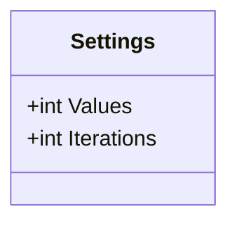

<div id="Test2Command.Settings-class-diagram"></div>

##### `Test2Command.Settings` class diagram


<div id="Test1Command-class-diagram"></div>

##### `Test1Command` class diagram

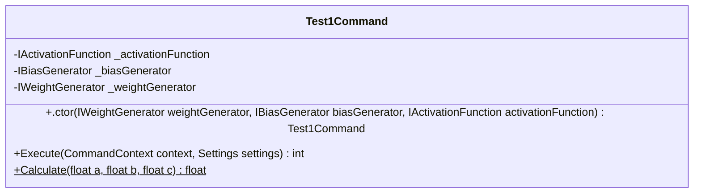

<div id="Test2Command-class-diagram"></div>

##### `Test2Command` class diagram

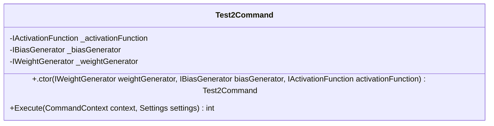

<div id="Helpers.FloatOutputComparer-class-diagram"></div>

##### `Helpers.FloatOutputComparer` class diagram

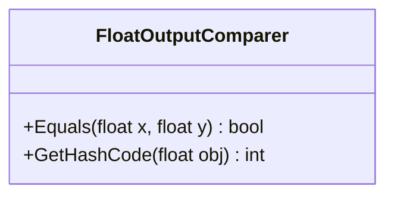

<div id="Helpers-class-diagram"></div>

##### `Helpers` class diagram

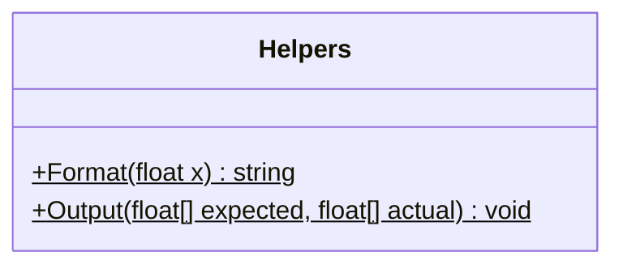

<div id="TypeRegistrar-class-diagram"></div>

##### `TypeRegistrar` class diagram

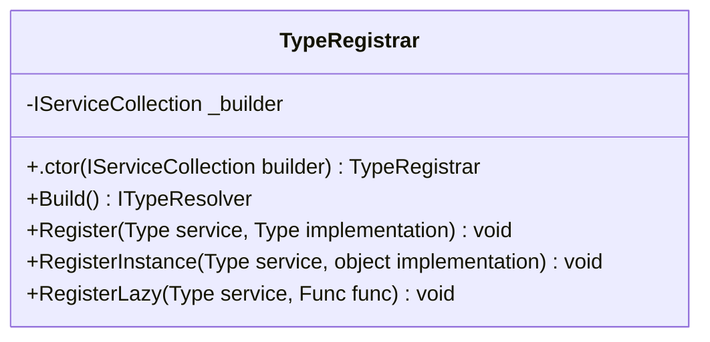

<div id="TypeResolver-class-diagram"></div>

##### `TypeResolver` class diagram

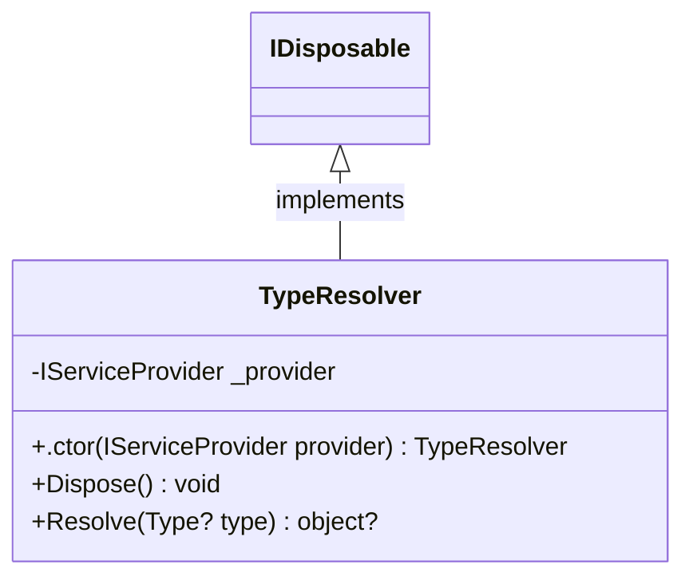

<div id="IActivationFunction-class-diagram"></div>

##### `IActivationFunction` class diagram

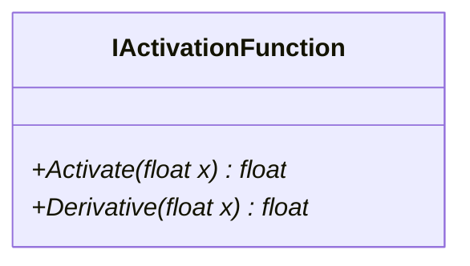

<div id="Leakyrelu-class-diagram"></div>

##### `Leakyrelu` class diagram

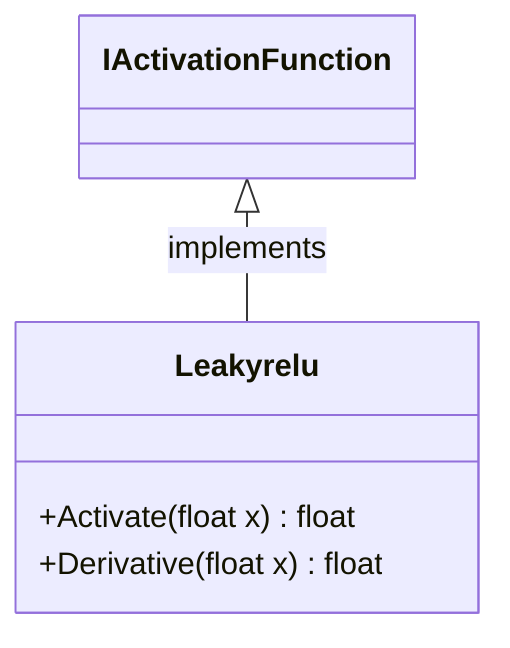

<div id="Relu-class-diagram"></div>

##### `Relu` class diagram

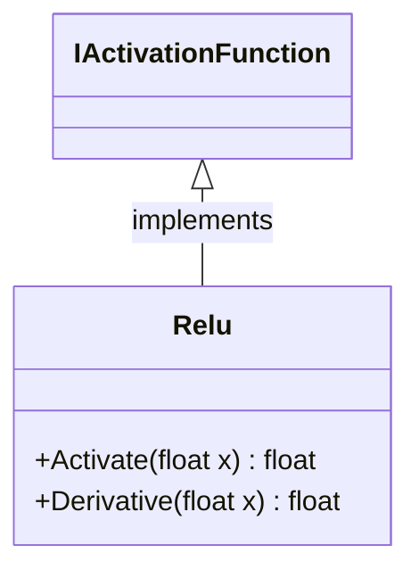

<div id="Sigmoid-class-diagram"></div>

##### `Sigmoid` class diagram

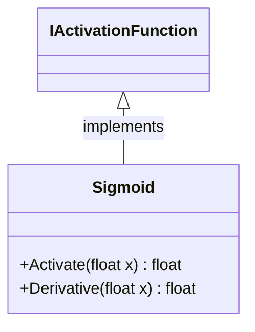

<div id="Tanh-class-diagram"></div>

##### `Tanh` class diagram

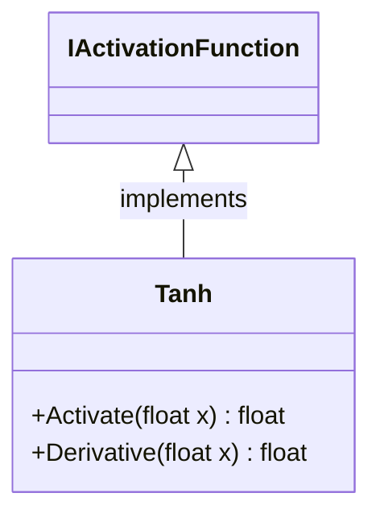

<div id="BiasGenerator-class-diagram"></div>

##### `BiasGenerator` class diagram

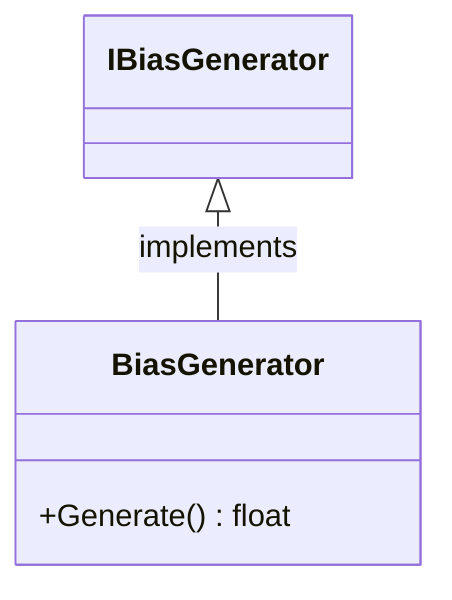

<div id="IBiasGenerator-class-diagram"></div>

##### `IBiasGenerator` class diagram

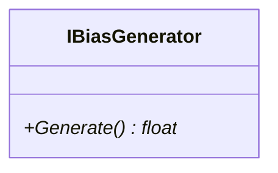

<div id="IWeightGenerator-class-diagram"></div>

##### `IWeightGenerator` class diagram

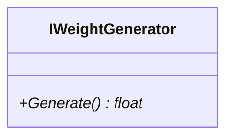

<div id="WeightGenerator-class-diagram"></div>

##### `WeightGenerator` class diagram

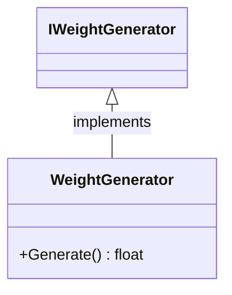

<div id="FloatMutator-class-diagram"></div>

##### `FloatMutator` class diagram

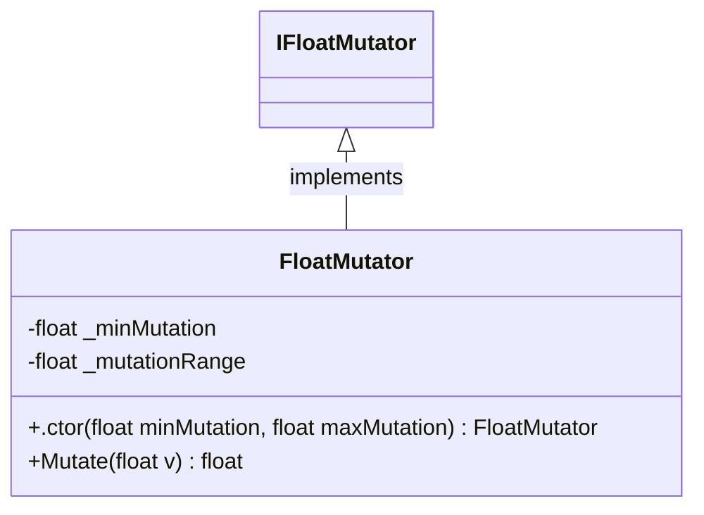

<div id="IFloatMutator-class-diagram"></div>

##### `IFloatMutator` class diagram

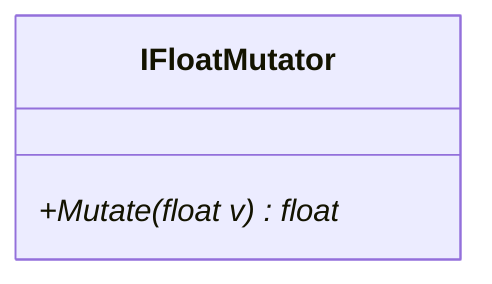

<div id="IMutationDecider-class-diagram"></div>

##### `IMutationDecider` class diagram

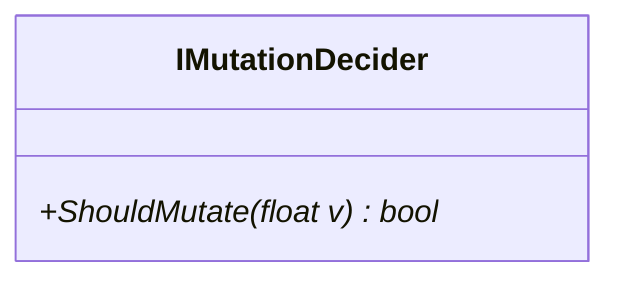

<div id="INetworkMutator-class-diagram"></div>

##### `INetworkMutator` class diagram

```mermaid
classDiagram
class INetworkMutator{
    +Mutate(NeuralNetwork network)* NeuralNetwork
    +Mutate(NeuralNetwork[] networks)* NeuralNetwork
}

```

<div id="MutationDecider-class-diagram"></div>

##### `MutationDecider` class diagram

```mermaid
classDiagram
IMutationDecider <|-- MutationDecider : implements
class MutationDecider{
    -float _mutationRate
    +.ctor(float mutationRate) MutationDecider
    +ShouldMutate(float v) bool
}

```

<div id="NetworkMutator-class-diagram"></div>

##### `NetworkMutator` class diagram

```mermaid
classDiagram
INetworkMutator <|-- NetworkMutator : implements
class NetworkMutator{
    -Func<NeuralNetwork, float> _fitnessFunction
    -IMutationDecider _mutationDecider
    -IFloatMutator _floatMutator
    +.ctor(Func<NeuralNetwork, float> fitnessFunction, IMutationDecider mutationDecider, IFloatMutator floatMutator) NetworkMutator
    +Mutate(NeuralNetwork network) NeuralNetwork
    +Mutate(NeuralNetwork[] networks) NeuralNetwork
    +Mutate(float value) float
}

```

<div id="Constants-class-diagram"></div>

##### `Constants` class diagram

```mermaid
classDiagram
class Constants{
    -float Tolerance$
}

```

<div id="NeuronExtensions-class-diagram"></div>

##### `NeuronExtensions` class diagram

```mermaid
classDiagram
class NeuronExtensions{
    +Connect(Neuron from, Neuron to, float weight)$ Connection
}

```

<div id="Connection-class-diagram"></div>

##### `Connection` class diagram

```mermaid
classDiagram
class Connection{
    +Neuron From
    +Neuron To
    +float Weight
    +.ctor(Neuron from, Neuron to, float weight) Connection
    +ToString() string
}

```

<div id="Neuron.ConnectionEquality-class-diagram"></div>

##### `Neuron.ConnectionEquality` class diagram

```mermaid
classDiagram
class ConnectionEquality{
    +Equals(Connection x, Connection y) bool
    +GetHashCode(Connection obj) int
}

```

<div id="Layer-class-diagram"></div>

##### `Layer` class diagram

```mermaid
classDiagram
class Layer{
    +Neuron[] Neurons
    +ToString() string
    +.ctor(Neuron[] neurons) Layer
    +Create(IBiasGenerator biasGenerator, int neuronCount)$ Layer
    +Create(LayerConfig layerConfig)$ Layer
    +Connect(IWeightGenerator weightGenerator, Layer layer) void
    +Connect(Layer layer, LayerConfig layerConfig) void
    +Activate(float[] inputs) void
    +Activate(IActivationFunction activation) void
    +Equals(Layer other) bool
    +GetHashCode() int
    +operator ==(Layer b1, Layer b2)$ bool
    +operator !=(Layer b1, Layer b2)$ bool
}

```

<div id="NeuralNetwork-class-diagram"></div>

##### `NeuralNetwork` class diagram

```mermaid
classDiagram
class NeuralNetwork{
    -float _learningRate
    -Layer[] Layers
    +.ctor(IWeightGenerator weightGenerator, IBiasGenerator biasGenerator, params int[] layers) NeuralNetwork
    +.ctor(NetworkConfig networkConfig) NeuralNetwork
    +From(object o)$ NeuralNetwork
    +FeedForward(IActivationFunction activationFunction, float[] inputs) float[]
    +BackPropagate(IActivationFunction activationFunction, float[] inputs, float[] expected) float[]
    +Equals(NeuralNetwork other) bool
    +GetHashCode() int
    +operator ==(NeuralNetwork b1, NeuralNetwork b2)$ bool
    +operator !=(NeuralNetwork b1, NeuralNetwork b2)$ bool
}

```

<div id="Neuron-class-diagram"></div>

##### `Neuron` class diagram

```mermaid
classDiagram
class Neuron{
    +NeuronData Data
    +float Bias
    +float Activation
    +List<Connection> In
    +List<Connection> Out
    +.ctor() Neuron
    +ToString() string
    +Adjust(float error, float learningRate) void
    +Equals(object obj) bool
    +Equals(Neuron other) bool
    +operator ==(Neuron b1, Neuron b2)$ bool
    +operator !=(Neuron b1, Neuron b2)$ bool
}

```

<div id="LayerConfig-class-diagram"></div>

##### `LayerConfig` class diagram

```mermaid
classDiagram
IEquatable~LayerConfig~ <|-- LayerConfig : implements
class LayerConfig{
    +List<NeuronData> Neurons
    +.ctor(List<NeuronData> Neurons) LayerConfig
    +Equals(LayerConfig other) bool
    +GetHashCode() int
}

```

<div id="NetworkConfig-class-diagram"></div>

##### `NetworkConfig` class diagram

```mermaid
classDiagram
IEquatable~NetworkConfig~ <|-- NetworkConfig : implements
class NetworkConfig{
    +List<LayerConfig> Layers
    +.ctor(List<LayerConfig> Layers) NetworkConfig
    +Equals(NetworkConfig other) bool
    +From(NeuralNetwork network)$ NetworkConfig
    +GetHashCode() int
}

```

<div id="NeuronData-class-diagram"></div>

##### `NeuronData` class diagram

```mermaid
classDiagram
IEquatable~NeuronData~ <|-- NeuronData : implements
class NeuronData{
    +float Bias
    +List<float> Weights
    +.ctor(float Bias, List<float> Weights) NeuronData
    +Equals(NeuronData other) bool
    +GetHashCode() int
}

```

<div id="MutationTests-class-diagram"></div>

##### `MutationTests` class diagram

```mermaid
classDiagram
class MutationTests{
    +NetworkMutator2n1nTest() void
}

```

<div id="LayerEqualityTests-class-diagram"></div>

##### `LayerEqualityTests` class diagram

```mermaid
classDiagram
class LayerEqualityTests{
    +LayerEquality() void
}

```

<div id="NeuralNetworkBackPropagateTests-class-diagram"></div>

##### `NeuralNetworkBackPropagateTests` class diagram

```mermaid
classDiagram
class NeuralNetworkBackPropagateTests{
    +BackPropagateOn1nNetwork() void
    +FeedForwardOn2n1nNetwork() void
    +FeedForwardOn2n3n2nNetwork() void
}

```

<div id="NeuralNetworkEqualityTests-class-diagram"></div>

##### `NeuralNetworkEqualityTests` class diagram

```mermaid
classDiagram
class NeuralNetworkEqualityTests{
    +NeuralNetworkSerialization() void
}

```

<div id="NeuralNetworkFeedForward-class-diagram"></div>

##### `NeuralNetworkFeedForward` class diagram

```mermaid
classDiagram
class NeuralNetworkFeedForward{
    +FeedForwardOn1nNetwork() void
    +FeedForwardOn2n1nNetwork() void
    +FeedForwardOn2n3n2nNetwork() void
}

```

<div id="NeuralNetworkSerializationTests-class-diagram"></div>

##### `NeuralNetworkSerializationTests` class diagram

```mermaid
classDiagram
class NeuralNetworkSerializationTests{
    +SingleLayerSingleNeuronNetworkSerialization() void
    +DoubleLayerDoubleNeuronNetworkSerialization() void
    +DoubleLayerDoubleNeuronNetworkDeserialization() void
}

```

<div id="NeuronEqualityTests-class-diagram"></div>

##### `NeuronEqualityTests` class diagram

```mermaid
classDiagram
class NeuronEqualityTests{
    +NeuronEquality() void
}

```

<div id="NeuronTests-class-diagram"></div>

##### `NeuronTests` class diagram

```mermaid
classDiagram
class NeuronTests{
    +NeuronAdjustUpdatesBias(float bias, float error, float learningRate, float expectedBias) void
}

```

*This file is maintained by a bot.*

<!-- markdownlint-restore -->
